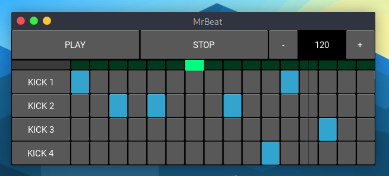

# MrBeat 🥁



---

**MrBeat** is a desktop drum machine / beat sequencer built with [Kivy](https://kivy.org/) and Python.

It lets you compose rhythmic patterns by toggling step buttons across 44 drum and percussion sounds from a built-in sample kit. Each track represents one sound — kick, snare, hats, booms, vocals, and more — and each step button represents a subdivided beat within the bar. Enable PLAY and the sequencer loops through all 16 steps at your chosen BPM, mixing every active track into a live audio stream powered by [sounddevice](https://python-sounddevice.readthedocs.io/) (PortAudio).

**Key features:**
- 🎚️ 44-track step sequencer with 16 steps per track
- 🥁 44 built-in drum/percussion samples (kicks, snares, hats, booms, vocals, FX…)
- ⏱️ Adjustable BPM (80–160) in real time
- 🔊 One-shot sound preview per instrument
- 📍 Visual play position indicator
- 🖥️ Python-based — audio powered by the bundled `audiostream` library (compiled once on first install)

---

## Requirements

- Python 3.11+
- **macOS**: [Homebrew](https://brew.sh/) (to install SDL)
- **Linux**: `apt-get` (tested on Ubuntu/Debian)

## Setup

Run the one-command installer — it handles everything automatically:

```bash
# Clone the repo
git clone https://github.com/teddy-christian/beat-maker.git
cd beat-maker

# Run the installer (handles SDL, venv, Python deps, and audiostream build)
chmod +x install.sh
./install.sh
```

> **macOS note**: Homebrew must be installed first. The script supports both Intel (`/usr/local`) and Apple Silicon (`/opt/homebrew`).

> **Linux note**: The script uses `sudo apt-get` to install SDL libraries. You will be prompted for your password.

## Run

```bash
source venv/bin/activate
python main.py
```

## Usage

| Element | Action |
|---------|--------|
| **PLAY / STOP** buttons | Start or stop playback |
| **− / +** buttons | Decrease / increase BPM (min 80, max 160) |
| **Left button** on each track | Preview the sound once |
| **Step buttons** (16 × per track) | Toggle steps on/off for the beat |
| **Scroll** | Scroll through all 44 kit sounds |

## Project Structure

```
beat-maker/
├── main.py                  # App entry point
├── audio_engine.py          # AudioEngine (output stream setup)
├── audio_source_mixer.py    # Mixes all tracks into one stream
├── audio_source_track.py    # Single beat-sequencer track
├── audio_source_one_shot.py # One-shot sound preview
├── sound_kit_service.py     # Loads WAV files from sounds/kit1/
├── track.py / track.kv      # TrackWidget UI
├── play_indicator.py/.kv    # Step position indicator bar
├── mrbeat.kv                # Main layout
└── sounds/kit1/             # 44 drum samples
```

## License

© 2026 teddy-christian — **All Rights Reserved.**  
Viewing the source code does not grant any right to use, copy, or distribute it.  
See [LICENSE](LICENSE) for details.
